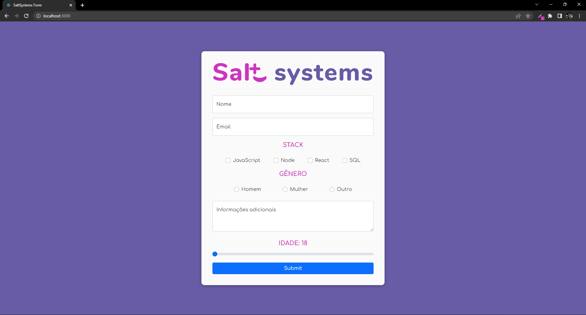
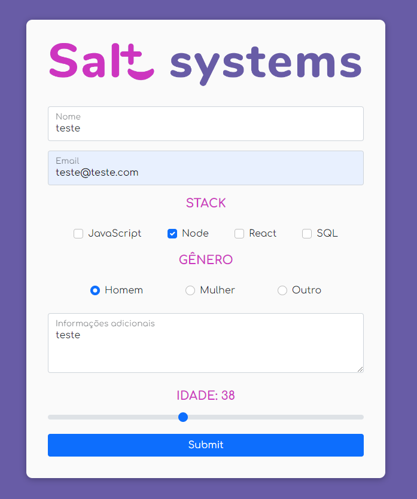
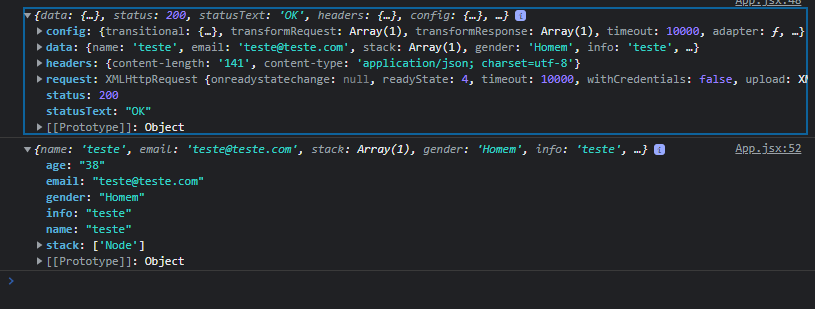
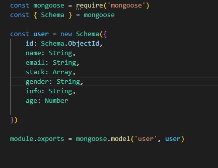

# Saltsystems Teste Bruno Luís Bahiense

## Objetivo:
### *"Construir um servidor em NodeJS, projetando um formulário simples usando BootstrapCSS que deve persistir no banco de dados MongoDB"*

<br/>

# Inicializando o projeto
### **AVISO: Como a ideia do projeto foi concebida em localhost, faz-se necessária a instalação do MongoDB à máquina afim de observar o completo funcionamento do mesmo!**
link do comunity server: https://www.mongodb.com/try/download/community


## Ambos os projetos estão disponibilizados neste mesmo repositório, assim ambos devem ser inicializados em terminais de forma separadamente. 

### Front
``` 
    yarn start  
``` 
### Back
```
    npm run dev
```

# Sobre o projeto
## Front
O Front-end do projeto foi concebido com a ideia de criar um cadastro simples de desenvolvedores ao banco de dados da Salt systems; assim utilizei o logo da empresa disponibilizado pela URL do site oficial da mesma e segui o esquema de cores.

Utilizei React para o desenvolvimento do site, assim como BootstrapCSS para a estilização.

A conexão com o banco de dados foi feita através do Axios somado ao MongoDB



### Populando o form


### Resposta após o submit 


## Back
Neste projeto foram utilizadas as seguintes tecnologias:
 - Nodemon
 - Express
 - Cors
 - MongoDB
 - Mongoose

O Back-end foi projetado utilizando a rota única **/form**.
Como a API foi projetada para localhost, decidi popular o arquivo *users.json* com as informações enviadas pelo front-end assim de garantir a persistência da mesma.

### Configuração do dado 



Utilizei o Schema para tratar o dado recebido pelo Front-end. O *Schema.ObjectId* cria um id aleatório para cada requisição, assim garantimos que cada usuário terá um identificador único no sistema.


Caso o tipo do dado seja diferente do que deve ser requisitado, o banco de dados emite um *error.message* informando no console o que houve, os dados são tratados no front, porém adicionei esta camada a fim de garantir que não seja alterado o tipo destas informações.


# Considerações finais

Como nunca havia utilizado o MongoDB, foi uma experiência desafiadora e gratificante pesquisar e aprender mais sobre esta tecnologia. Dediquei uma grande parte do tempo disponibilizado para entender o conceito e buscar formas de aplicá-lo ao sistema no qual havia desenvolvido.

Acredito que com o tempo, eu acrescentaria um live-server para nutrir o sistema, assim não utilizaria mais o *localhost* nem o arquivo *users.js* para salvar os dados recebidos; porém, agradeço demais pela experiência e pelo desafio!